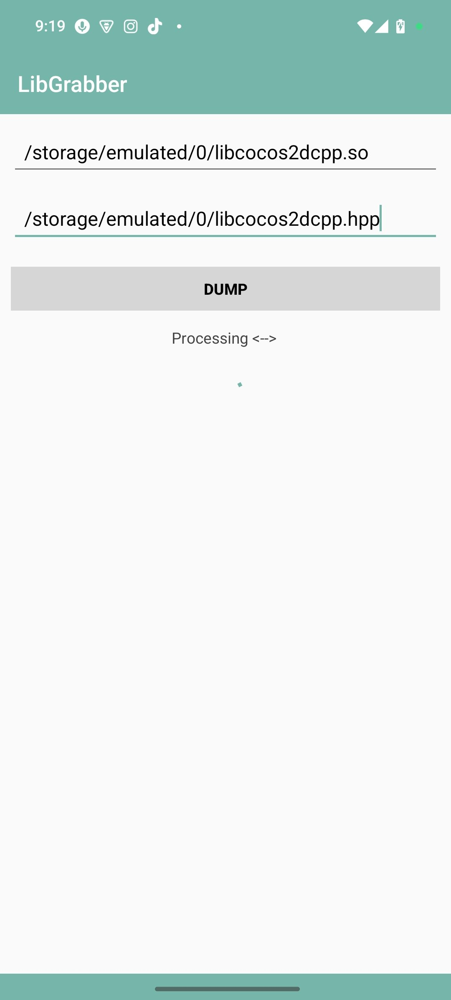
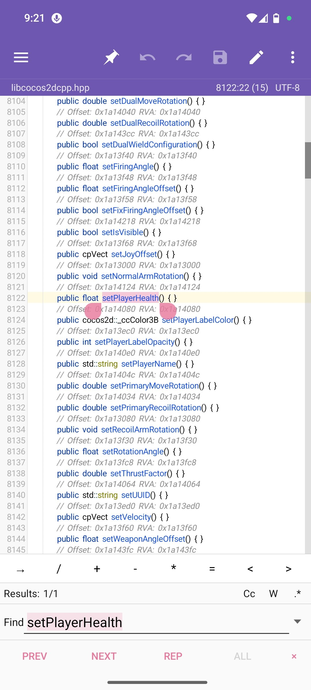

<p align="center">
  
</p>
# LibGrabber


LibGrabber 1.0 is an Android tool designed to Dump lib sdk  || External Working...!

## How It Works

logic from the following open-source repositories:

- [Efl C++](https://github.com/Enlightenment/efl)
---

## Overview

LibGrabber is a powerful Android application designed to parse, analyze, and dump symbol tables from shared object .so files. It extracts function names, variable names, and other exported symbols from native libraries, generating comprehensive C++ header files for reverse engineering, analysis, and development purposes


|  | [LibGrabber](https://github.com/ispointer/LibGrabber) |
|-------------------------------------------------------------------------------------------------------------------------------|---------------------------------------------------|

## Screenshots
| App UI                                                                 | Dump Style                                                                    |
| ---------------------------------------------------------------------------- | --------------------------------------------------------------------------- |
|  |  |

## License

- [Apache-2.0](https://www.apache.org/licenses/LICENSE-2.0)

```
Apache License Version 2.0

Copyright (C) 2026 HighCapable

Licensed under the Apache License, Version 2.0 (the "License");
you may not use this file except in compliance with the License.
You may obtain a copy of the License at

    https://www.apache.org/licenses/LICENSE-2.0

Unless required by applicable law or agreed to in writing, software
distributed under the License is distributed on an "AS IS" BASIS,
WITHOUT WARRANTIES OR CONDITIONS OF ANY KIND, either express or implied.
See the License for the specific language governing permissions and
limitations under the License.
```

Copyright © 2026 HighCapable
